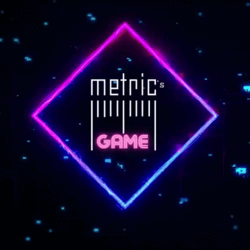

<p align="center">
    
</p>
<h1 align="center">Metrics Game</h1>

<h4 align="center"> 
	🚧  Metrics Game 🎮📏 Em andamento  🚧
</h4>

## 💻 Sobre o Projeto
Este projeto teve como desafios para nosso grupo:

Análisar banco de dados cedido a partir tema escolhido (<a href="https://store.steampowered.com/app/353380/Steam_Link/">Steam</a>) e a após a análise: criar gráficos que facilitem a visualização de questões criadas e pensadas pelo time, lembrando que esse processo foi concluído exclusivamente de acordo com os dados.

• Soft Skills: Scrum, Kanban e Trello

---
## ⚙️ Funcionalidades
- [x] Os usuários tem acesso ao site por meio do computador, onde podem:
    - [x] Acesso ao jogo com todas as salas e seus respectivos gráficos.
    - [x] Definir o caminho que será seguido durante o jogo.
    - [x] Entrar nas salas onde se encontram os gráficos.
    - [x] Acesso aos gráficos baseando-se no banco de dados do steam.

---

## 🎨 Layout

O layout da aplicação está disponível no Figma:

<a href="https://www.figma.com/file/D41nbP0LDvkQfpi2z7JcjL/Hades-%7C-Barber-Lounge?node-id=1%3A2">
  
</a>

### Web
<!-- PRINT dO SITE NO COMPUTADOR -->
<p align="center" style="display: flex; align-items: flex-start; justify-content: center;">
  

  
</p>

---

## 🚀 Como executar o projeto

### Pré-requisitos

Antes de começar, você vai precisar ter instalado em sua máquina as seguintes ferramentas:
[Git](https://git-scm.com). 
Além disto é bom ter um editor para trabalhar com o código como [VSCode](https://code.visualstudio.com/)

#### 🧭 Rodando a aplicação web (Frontend)

```bash

# Clone este repositório
$ git clone git@github.com:sashamoon/projetoHadesBarbearia.git

# Acesse a pasta do projeto no seu terminal/cmd
$ cd projetoHadesBarbearia

# Abrir projeto no vscode
$ code .

# A aplicação será aberta na porta:3000 - acesse http://localhost:3000

```
---
## 🛠 Tecnologias

Utilizamos um banco de dados sql para carregar os dados fornecidos em um documento csv e a partir dele montamos as query utilizando o MySQL Workbench, depois carregamos as query no MetaBase fornecido pela Resilia.

As seguintes ferramentas foram usadas na construção do projeto:
#### **Website**

-   HTML 5
-   CSS 3
-   **[JavaScript](https://www.javascript.com/)**

#### **Banco de dados e gráficos**
• MySQL
• Workbench
• PowerBI

#### **Utilitários**

-   Protótipo:  **[Figma](https://www.figma.com/)**  →  **[Protótipo (Metrics Game)](https://www.figma.com/file/U7q60nvZTSnQifSkoHPq8h/Layout-Jogo-Metrics-Game?node-id=0%3A1)**
-   Editor:  **[Visual Studio Code](https://code.visualstudio.com/)**
-   Markdown:  **[StackEdit](https://stackedit.io/)**,  **[Markdown Emoji](https://gist.github.com/rxaviers/7360908)**
-   Ícones:  **[Feather Icons](https://feathericons.com/)**,  **[Font Awesome](https://fontawesome.com/)**
-   Fontes:  **[VT323](https://fonts.google.com/specimen/VT323?query=vt)**

---
---

## 🦸 Autores

<table>
<tr>
<td>
<a href="https://github.com/sashamoon">
    
    <br>
    <sub><b>Bernardo Moura</b></sub>
</a> 
<a href="https://github.com/bernardobdr">🎸</a>
<br>

[](https://www.linkedin.com/in/bernardomoura/) 
[](mailto:rafaeladiasneves95@gmail.com)

</td>
<td>
<p><stong>Experiência:</stong></p>
</td>
</tr>
</table>

<br>

<table>
<tr>
<td>
<a href="https://github.com/sashamoon">
    
    <br>
    <sub><b>Bruno Santana de Sá</b></sub>
</a> 
<a href="https://github.com/brunosa91">🎸</a>
<br>

[](https://www.linkedin.com/in/brunoasantanadesa/) 
[](mailto:rafaeladiasneves95@gmail.com)

</td>
<td>
<p><stong>Experiência:</stong></p>
</td>
</tr>
</table>

<br>

<table>
<tr>
<td>
<a href="https://github.com/sashamoon">
    
    <br>
    <sub><b>Mauricio Oliveira</b></sub>
</a> 
<a href="https://github.com/Mauriciiow">🎸</a>
<br>

[](https://www.linkedin.com/in/mauricio-oliveira-vila-nova-86922b214/) 
[](mailto:rafaeladiasneves95@gmail.com)

</td>
<td>
<p><stong>Experiência:</stong></p>
</td>
</tr>
</table>

<br>

<table>
<tr>
<td>
<a href="https://github.com/sashamoon">
    
    <br>
    <sub><b>Rafaela Dias</b></sub>
</a> 
<a href="https://github.com/rafaeladns">🎸</a>
<br>

[](https://www.linkedin.com/in/rafaela-sousa-8305a7224/) 
[](mailto:rafaeladiasneves95@gmail.com)

</td>
<td>
<p><stong>Experiência:</stong></p>
</td>
</tr>
</table>

<br>

<table>
<tr>
<td>
<a href="https://github.com/sashamoon">
    
    <br>
    <sub><b>Sarah Alves</b></sub>
</a>
<a href="https://github.com/sashamoon">🦄</a>
<br>

[](https://www.linkedin.com/in/sarahalvesoliveira/) 
[](mailto:salves726@gmail.com)

</td>
<td>
<p><stong>Experiência:</stong></p>
</td>
</tr>
</table>

<br>

---

## 📝 Licença

Este projeto esta sobe a licença [MIT](./LICENSE).

Feito com ❤️ por Bernardo Moura, Bruno Santana de Sá, Mauricio Oliveira, Rafaela Dias e Sarah Alves 👋🏽

---