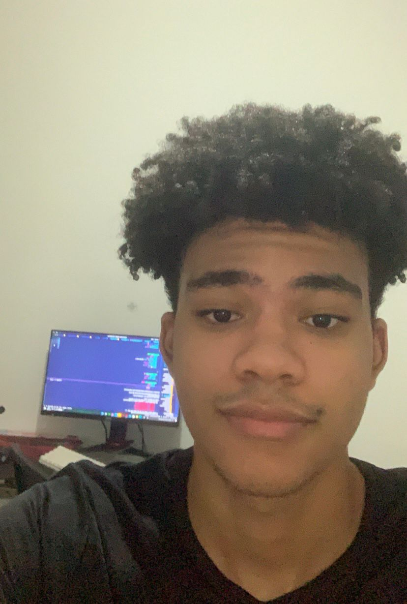

<p align="center">
    
</p>
<h1 align="center">Metrics Game</h1>

<h4 align="center"> 
	🚧  Metrics Game 🎮📏 Em andamento  🚧
</h4>

## 💻 Sobre o Projeto
Este projeto teve como desafios para nosso grupo:

Análisar banco de dados cedido a partir tema escolhido (<a href="https://store.steampowered.com/app/353380/Steam_Link/">Steam</a>) e a após a análise: criar gráficos que facilitem a visualização de questões criadas e pensadas pelo time, lembrando que esse processo foi concluído exclusivamente de acordo com os dados.

• Soft Skills: Scrum, Kanban e Trello

---
## ⚙️ Funcionalidades
- [x] Os usuários tem acesso ao site por meio do computador, onde podem:
    - [x] Acesso ao jogo com todas as salas e seus respectivos gráficos.
    - [x] Definir o caminho que será seguido durante o jogo.
    - [x] Entrar nas salas onde se encontram os gráficos.
    - [x] Acesso aos gráficos baseando-se no banco de dados do steam.

---

## 🎨 Layout

O layout da aplicação está disponível no Figma:

<a href="https://www.figma.com/file/D41nbP0LDvkQfpi2z7JcjL/Hades-%7C-Barber-Lounge?node-id=1%3A2">
  
</a>

### Web
<!-- PRINT dO SITE NO COMPUTADOR -->
<p align="center" style="display: flex; align-items: flex-start; justify-content: center;">
  

  
</p>

---

## 🚀 Como executar o projeto

### Pré-requisitos

Antes de começar, você vai precisar ter instalado em sua máquina as seguintes ferramentas:
[Git](https://git-scm.com). 
Além disto é bom ter um editor para trabalhar com o código como [VSCode](https://code.visualstudio.com/)

#### 🧭 Rodando a aplicação web (Frontend)

```bash

# Clone este repositório
$ git clone https://github.com/alvesarah/metricsgame_Steam.git

# Acesse a pasta do projeto no seu terminal/cmd
$ cd metricsGame

# Abrir projeto no vscode
$ code .

# A aplicação será aberta na porta:3000 - acesse http://localhost:3000

```
---
## 🛠 Tecnologias

Utilizamos um banco de dados sql para carregar os dados fornecidos em um documento csv e a partir dele montamos as query utilizando o MySQL Workbench, depois carregamos as query no MetaBase fornecido pela Resilia.

As seguintes ferramentas foram usadas na construção do projeto:
#### **Website**

-   HTML 5
-   CSS 3
-   **[JavaScript](https://www.javascript.com/)**

#### **Banco de dados e gráficos**
- MySQL
- Workbench
- PowerBI

#### **Utilitários**

-   Protótipo:  **[Figma](https://www.figma.com/)**  →  **[Protótipo (Metrics Game)](https://www.figma.com/file/U7q60nvZTSnQifSkoHPq8h/Layout-Jogo-Metrics-Game?node-id=0%3A1)**
-   Editor:  **[Visual Studio Code](https://code.visualstudio.com/)**
-   Markdown:  **[StackEdit](https://stackedit.io/)**,  **[Markdown Emoji](https://gist.github.com/rxaviers/7360908)**
-   Ícones:  **[Feather Icons](https://feathericons.com/)**,  **[Font Awesome](https://fontawesome.com/)**
-   Fontes:  **[VT323](https://fonts.google.com/specimen/VT323?query=vt)**

---

# Perguntas
### Pergunta 1 

- Top 5 jogos mais populares (Com base no tempo gasto jogando e segundo as avaliações positivas)

```sql
SELECT 
    name AS nome_do_jogo,
    positive_ratings AS avaliações_positivas,
    average_playtime AS horas_gastas_jogando
FROM
    steam
WHERE
    positive_ratings > 9000 
    AND average_playtime > 10000
LIMIT 5;
```


### Pergunta 2

- Jogos que precisam ter idade mínima de 18 anos, do gênero ação e que rodam apenas em windows

```sql
SELECT 
    name AS nome_do_jogo,
    required_age AS idade_obrigatória,
    genres AS genero,
    platforms AS sistema_operacional
FROM
    steam
WHERE
    required_age = 18
        AND genres LIKE 'Action'
        AND platforms = 'windows'
ORDER BY name ASC LIMIT 15;
```


### Pergunta 3

- Quantidade em percentual de jogos disponibilizados gratuitamente em relação ao total de jogos

```sql
SELECT 
    ROUND(((SELECT 
                    COUNT(price)
                FROM
                    steam
                WHERE
                    price = 0) / COUNT(price) * 100),
            2) AS porcentagem_jogos_gratuitos
FROM
    steam; 
```


### Pergunta 4

- Quais os 5 setups para os jogos mais bem avaliados da steam?

```sql
SELECT srd.steam_appid, 
       s.positive_ratings as avaliacoes_positivas, 
       s.name as jogos, 
       srd.minimum as setup
FROM steam AS s
INNER JOIN steam_requirements_data as srd
ON srd.steam_appid = s.appid
ORDER BY s.positive_ratings DESC
LIMIT 5;
```


### Pergunta 5

- Quais os 5 setups para os jogos mais jogados da steam?

```sql
SELECT  s.appid, 
        s.owners as quantidade_de_downloads,
        s.name as jogos, 
        srd.minimum as setup 
FROM steam AS s
INNER JOIN steam_requirements_data as srd
ON srd.steam_appid = s.appid
ORDER BY s.owners DESC
LIMIT 5;
```


### Pergunta 6

- Quais os 3 setups dos jogos mais jogados da categoria multi-player?

```sql
SELECT srd.steam_appid, 
       s.name, 
       s.average_playtime,
       srd.minimum, 
       s.categories
FROM steam AS s
INNER JOIN steam_requirements_data as srd
ON srd.steam_appid = s.appid
where categories like 'Multi-player'
order by average_playtime desc
LIMIT 3;
```


### Pergunta 7

- Top 10 desenvolvedores com jogos mais jogados

```sql
SELECT 
    developer AS desenvolvedores,
    name AS nome_jogo,
    average_playtime AS tempo_jogado
FROM
    steam
WHERE
    average_playtime > 0
GROUP BY developer
LIMIT 10;	
```


### Pergunta 8

- Jogos co-op com avaliações positivas maiores que negativas

```sql
SELECT 
    steam.name AS jogos_co_op,
    steam.positive_ratings AS avaliacoes_positivas
FROM
    steam
        INNER JOIN
    steamspy_tag_data ON steam.appid = steamspy_tag_data.appid
WHERE
    steamspy_tag_data.co_op > 0
        AND steam.positive_ratings > steam.negative_ratings
ORDER BY steam.positive_ratings DESC
LIMIT 15;

```


### Pergunta 9

- Jogos single-player com avaliações negativas maiores que positivas

```sql
SELECT 
    steam.name AS jogos_single_player,
    steam.negative_ratings AS avaliacoes_negativas
FROM
    steam
        INNER JOIN
    steamspy_tag_data ON steam.appid = steamspy_tag_data.appid
WHERE
    steamspy_tag_data.singleplayer > 0
        AND steam.positive_ratings < steam.negative_ratings
ORDER BY steam.negative_ratings DESC
LIMIT 15;
```


### Pergunta 10

- Jogos que mais estão presentes nos e-sports(esporte eletrônico)

```sql
SELECT 
    steam.name as jogos_esports,
    steamspy_tag_data.e_sports 
FROM
    steam
        INNER JOIN
    steamspy_tag_data ON steam.appid = steamspy_tag_data.appid
WHERE
    steamspy_tag_data.e_sports > 0;
```


## 🦸 Autores

<table>
<tr>
<td>
<a href="https://github.com/sashamoon">
    
    <br>
    <sub><b>Bernardo Moura</b></sub>
</a> 
<a href="https://github.com/bernardobdr">🎸</a>
<br>

[](https://www.linkedin.com/in/bernardomoura/) 
[](mailto:rafaeladiasneves95@gmail.com)

</td>
<td>
<p><stong>Experiência:</stong></p>
</td>
</tr>
</table>

<br>

<table>
<tr>
<td>
<a href="https://github.com/sashamoon">
    
    <br>
    <sub><b>Bruno Santana de Sá</b></sub>
</a> 
<a href="https://github.com/brunosa91">🎸</a>
<br>

[](https://www.linkedin.com/in/brunoasantanadesa/) 
[](mailto:rafaeladiasneves95@gmail.com)

</td>
<td>
<p><stong>Experiência:</stong></p>
</td>
</tr>
</table>

<br>

<table>
<tr>
<td>
<a href="https://github.com/sashamoon">
    
    <br>
    <sub><b>Mauricio Oliveira</b></sub>
</a> 
<a href="https://github.com/Mauriciiow">🎸</a>
<br>

[](https://www.linkedin.com/in/mauricio-oliveira-vila-nova-86922b214/) 
[](mailto:rafaeladiasneves95@gmail.com)

</td>
<td>
<p><stong>Experiência:</stong></p>
</td>
</tr>
</table>

<br>

<table>
<tr>
<td>
<a href="https://github.com/sashamoon">
    
    <br>
    <sub><b>Rafaela Dias</b></sub>
</a> 
<a href="https://github.com/rafaeladns">🎸</a>
<br>

[](https://www.linkedin.com/in/rafaela-sousa-8305a7224/) 
[](mailto:rafaeladiasneves95@gmail.com)

</td>
<td>
<p><stong>Experiência:</stong></p>
</td>
</tr>
</table>

<br>

<table>
<tr>
<td>
<a href="https://github.com/sashamoon">
    
    <br>
    <sub><b>Sarah Alves</b></sub>
</a>
<a href="https://github.com/sashamoon">🦄</a>
<br>

[](https://www.linkedin.com/in/sarahalvesoliveira/) 
[](mailto:salves726@gmail.com)

</td>
<td>
<p><stong>Experiência:</stong></p>
</td>
</tr>
</table>

<br>

---

## 📝 Licença

Este projeto esta sobe a licença [MIT](./LICENSE).

Feito com ❤️ por Bernardo Moura, Bruno Santana de Sá, Mauricio Oliveira, Rafaela Dias e Sarah Alves 👋🏽

---